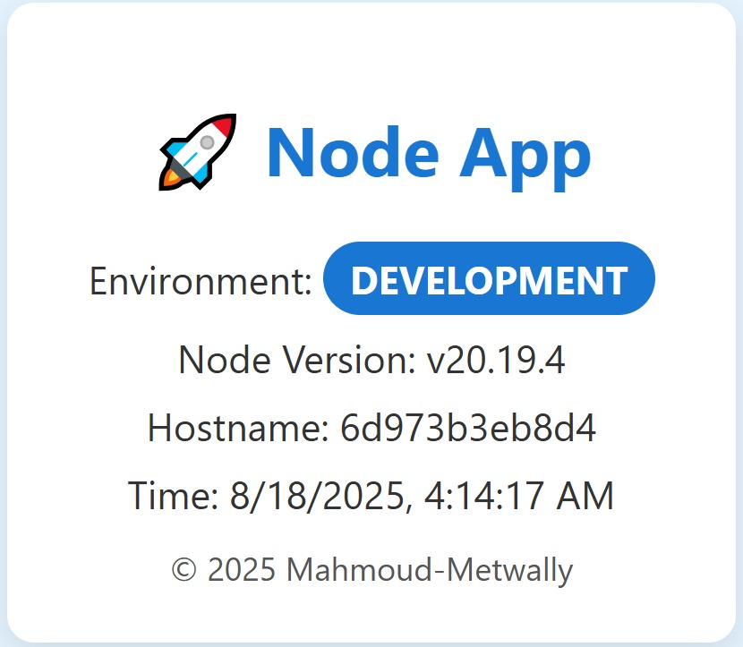
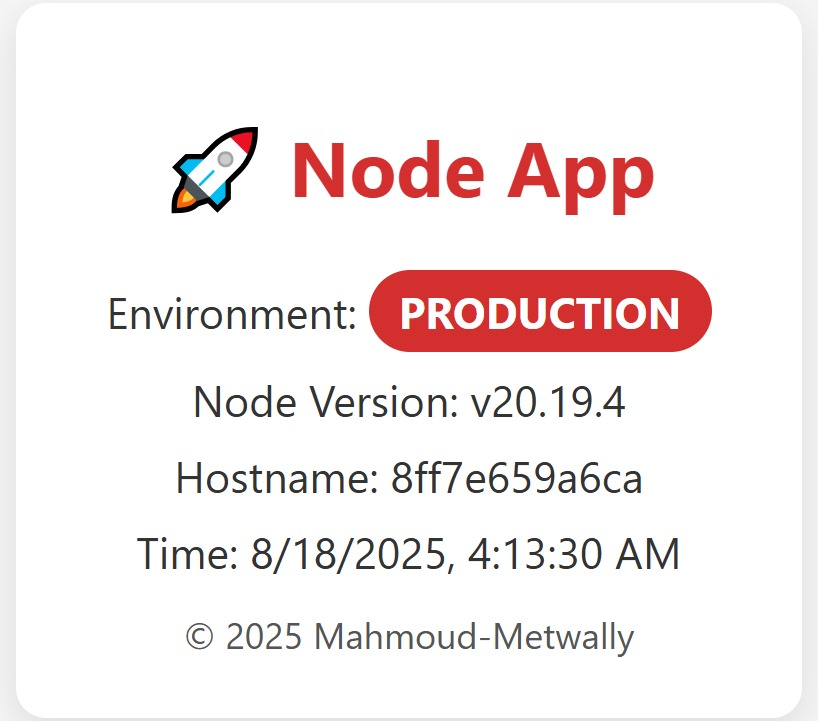

# 🚀 Node.js + Docker + Nginx Production Setup
[](https://gitpod.io/new/#https://github.com/Mahmoudmetwall2y/production-ready-Node.js-app-with-Docker-Nginx)


A professional Node.js project demonstrating **multi-stage Docker builds**, **Docker Compose for dev & prod**, and an **Nginx reverse proxy** for a production-ready deployment.

---

## 🔧 Features
- Multi-stage Dockerfile (development & production)
- Healthcheck endpoint (`/health`)
- Nginx reverse proxy in production
- Hot-reload in development
- Environment-based configuration
- Makefile with shortcuts
- `.env` support for multiple environments

---

## 📂 Project Structure  

```bash
.
├── src/                      # Node.js source code
│   └── index.js              # Main Express server
├── nginx.conf                 # Nginx reverse proxy config
├── Dockerfile                 # Multi-stage Dockerfile
├── docker-compose.yml         # Base compose file
├── docker-compose.dev.yml     # Dev overrides
├── docker-compose.prod.yml    # Prod overrides
├── .env.example               # Example env file
├── .env.development           # Development env vars
├── .env.production            # Production env vars
├── .dockerignore              # Ignore files for Docker builds
├── Makefile                   # Shortcut commands
└── README.md                  # Documentation
```

---

## 📸 Screenshots  

**Development Mode (Blue Badge)**  
  

**Production Mode (Red Badge)**  
  

---

## 🖥️ Tech Stack  

-   
-   
-   
-   

---

## 👨‍💻 Author  

**Mahmoud Metwally**  
🔗 [LinkedIn](https://www.linkedin.com/in/mahmoudmetwall2y)  
💻 [GitHub](https://github.com/Mahmoudmetwall2y)  


---

## 🌍 Try it Live

You can spin up this project instantly in your browser with **GitPod**:

[](https://gitpod.io/#https://github.com/Mahmoudmetwall2y/node-docker-nginx-setup)

- Development server → opens automatically at **port 5000**
- Production server → available manually at **port 8000**


